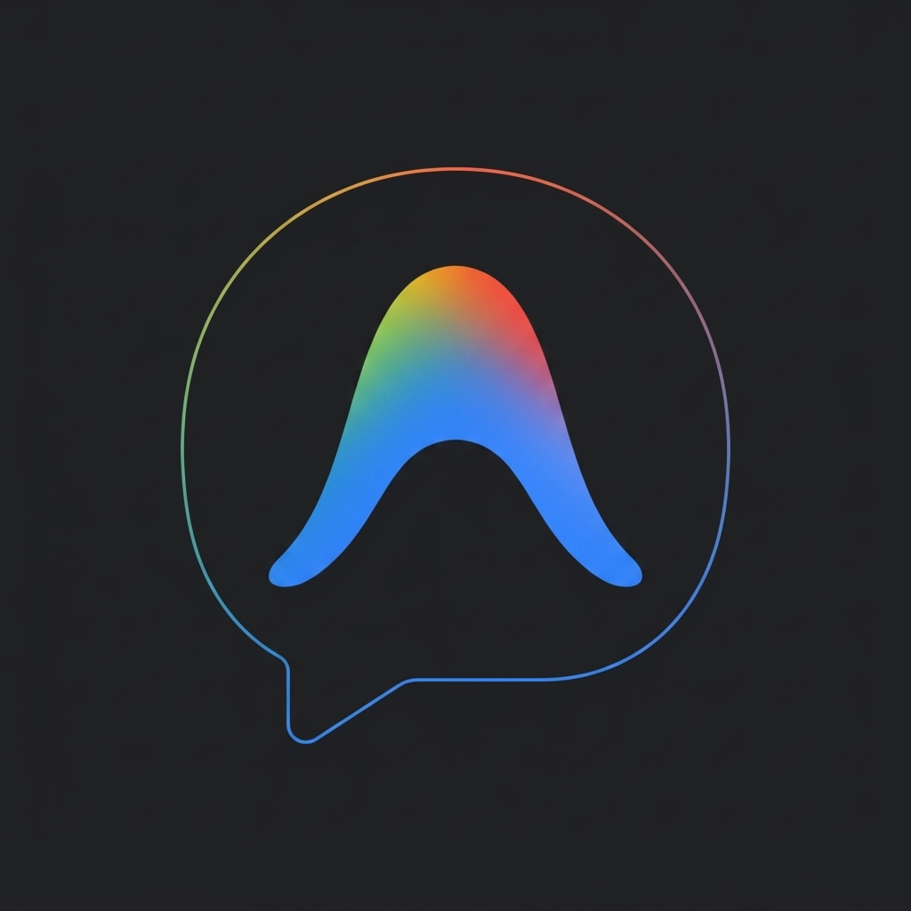

<p align="center">
  
</p>

<h1 align="center">agycon</h1>

<p align="center">
  <strong>Fast, interactive CLI launcher and manager for Google Antigravity (<code>agy</code>) conversations, built in Rust.</strong>
</p>

<p align="center">
  <a href="#features">Features</a> &bull;
  <a href="#installation">Installation</a> &bull;
  <a href="#usage">Usage</a> &bull;
  <a href="#settings--configuration">Configuration</a>
</p>

---

## Features

- **Interactive Conversation Picker**: Fuzzy search across past Antigravity conversations using keyboard navigation and live search.
- **Conversation Action Submenu**:
  - `[>] Resume`: Launch directly into `agy`.
  - `[?] Preview`: View conversation summary, timestamps, turn counts, and latest messages.
  - `[#] Pager Viewer`: Read the full transcript directly in your terminal pager (`less -R`).
  - `[v] Markdown Export`: Export clean Markdown files with headers and turn formatting.
  - `[e] Rename`: Rename auto-generated session titles directly in SQLite.
  - `[x] Delete`: Safely delete sessions with option to purge database and brain logs from disk.
- **Smart Workspace & Timeframe Filtering**:
  - Filters strictly to the current working directory by default.
  - In-menu toggle to switch between current workspace and all projects.
  - In-menu timeframe filter cycling through `All Time`, `Last 24 Hours`, `Last 7 Days`, and `Last 30 Days`.
- **Configurable Default Behavior**:
  - Persistently toggle whether to filter to the current directory by default or show all workspaces.
  - Stored in `~/.config/agycon/config.json`.
- **Zero Overhead Process Replacement**:
  - Uses Unix `exec` to replace the `agycon` process with `agy`, ensuring seamless terminal control, signal handling, and zero memory overhead.
- **Embedded SQLite**:
  - Built with bundled SQLite, requiring no external `sqlite3` CLI or system libraries.

## Installation

Build and install the binary:

```bash
cargo build --release
cp target/release/agycon ~/.local/bin/
```

Or via Cargo:

```bash
cargo install --path .
```

## Usage

### Interactive Menu
Launch the interactive selector in your current workspace:

```bash
agycon
```

View all conversations across all projects:

```bash
agycon --all
```

Force filter strictly to current directory:

```bash
agycon --current
```

### Direct Actions
Start a new conversation immediately:

```bash
agycon --new
```

Continue the latest conversation:

```bash
agycon --continue
```

Print matching conversations non-interactively:

```bash
agycon --list
agycon --all --list
```

### Full-Text Search
Search through conversation messages and transcripts:

```bash
# Direct CLI search
agycon search "sqlite"

# Interactive search UI
agycon search
```

### Analytics & Statistics
View system-wide activity metrics and on-disk storage usage:

```bash
agycon stats
```

### Batch Operations
Bulk-select conversations with checkboxes to export to Markdown or permanently delete:

```bash
agycon batch
```

### Shell Auto-Completion
Generate autocompletion scripts for your shell:

```bash
# Bash
agycon completion bash > ~/.local/share/bash-completion/completions/agycon

# Zsh
agycon completion zsh > ~/.zfunc/_agycon

# Fish
agycon completion fish > ~/.config/fish/completions/agycon.fish
```

Display the logo in your terminal:

```bash
agycon logo
```

### Settings & Configuration
View current configuration:

```bash
agycon config
```

Change default filter mode:

```bash
# Filter to current workspace by default
agycon config --set current

# Show all workspaces by default
agycon config --set all
```

You can also change the default filter mode directly inside the interactive menu under `[*] Configure default filter setting`.
